| Attribute | Value |
| :--- | :--- |
| **Title** | Flight Safety Control Pattern Catalog |
| **Version** | 1.0.0 |
| **Date** | 2026-09-02 |
| **Parent Epic** | Epic 20: Avionic Flight Safety Architecture |

# Flight Safety Control Pattern Catalog

## 1. Executive Summary & Architectural Scope
This catalog establishes the canonical repository of formal avionic flight-safety control patterns within the **DEAP01-avionic-flight-safety** domain repository under Epic 20 (*Avionic Flight Safety Architecture & High-Integrity Control Patterns*).

Airborne safety-critical systems require deterministic, provable fault mitigation architectures conforming to civil and defense certification standards including RTCA DO-178C (DAL A/B), RTCA DO-254 (DAL A/B), SAE ARP4754A, SAE ARP4761, MIL-STD-882E, ASTM F3269-17, FAA AC 20-152A, JARUS SORA v2.5, ASTM F3411-22a, and FAA 14 CFR §107.39.

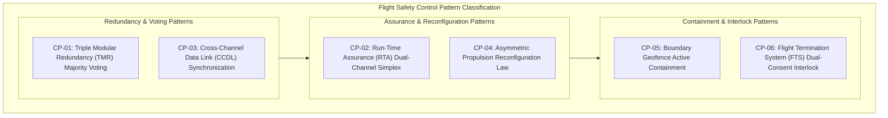

---

## 2. Master Control Pattern Population Summary

| Pattern ID | Pattern Title | Issuing Regulatory / Standard Baseline | Primary Safety Objective | Verification Mechanism | Status |
| :--- | :--- | :--- | :--- | :--- | :--- |
| `CP-01` | Triple Modular Redundant (TMR) Majority Voting with Byzantine Fault Tolerance | FAA AC 20-152A §4.2, SAE ARP4754A §5.4.2 | Single-channel fault masking, transient glitch isolation, Byzantine agreement | Formal Model Checking & Redundancy Injection HIL Test | Canonical |
| `CP-02` | ASTM F3269-17 Run-Time Assurance (RTA) Dual-Channel Simplex Architecture | ASTM F3269-17 §5.1–§5.3, RTCA DO-178C §6.3.1 | Complex/AI controller bounding, fail-safe envelope recovery | Control Barrier Function Proof & Real-Time Envelope Monitor | Canonical |
| `CP-03` | Cross-Channel Data Link (CCDL) Synchronization & Deterministic State Lock | RTCA DO-178C §6.3.2, RTCA DO-254 §5.5.1 | Frame-synchronous lockstep execution, zero state skew across channels | Lockstep Jitter Analysis & Bit-Level Data Coupling Test | Canonical |
| `CP-04` | Asymmetric Propulsion / Actuator Degradation Reconfiguration Law | SAE ARP4761 §4.4, MIL-STD-882E Task 205 §4.2 | In-flight thrust redistribution, actuator jam/loss trim compensation | Quadratic Programming Solver & Dynamic In-Flight Engine Trim | Canonical |
| `CP-05` | Boundary Geofence Active Containment & Failsafe Return-to-Home / Divert | JARUS SORA v2.5 Annex B §B.2, ASTM F3411-22a §6.3 | 3D spatial boundary containment, emergency return-to-home routing | Spatial Polytope Projection & Autonomous Failsafe Flight Test | Canonical |
| `CP-06` | Flight Termination System (FTS) Dual-Consent Command Interlock | FAA 14 CFR §107.39, MIL-STD-882E Task 204 §4.1 | Independent dual-consent interlock preventing un-commanded termination | Dual-Path Hardware Interlock Test & Squib Firing Simulation | Canonical |

---

## 3. Pattern CP-01: Triple Modular Redundant (TMR) Majority Voting with Byzantine Fault Tolerance

### 3.1 Context & Regulatory Basis
- **Pattern ID:** `CP-01`
- **Applicable Standards:** FAA AC 20-152A §4.2 (*COTS Redundancy Management*), SAE ARP4754A §5.4.2 (*Safety Assessment Process Allocation & Dissimilar Architectures*), RTCA DO-254 §5.5.1 (*Fault Tolerance & Majority Voting*).
- **Design Assurance Allocation:** DAL A / DAL B, Hazard Severity: Catastrophic / Hazardous ($10^{-9}/\text{flight hour}$).

/// ObligationAllocation: [OBL-DO254-02, OBL-ARP4754A-03]
/// ObligationWitness: [OBL-DO254-02, OBL-ARP4754A-03]

### 3.2 Architectural Description
Pattern `CP-01` establishes a triplicated active processing architecture comprising three independent, isolated processing channels (Channel A, Channel B, Channel C) coupled with a Byzantine-tolerant majority voter. Continuous control variables (such as servo demand or attitude angles) undergo Mid-Value Selection (MVS) / Median Voting, while discrete logical safety decisions undergo 2-out-of-3 ($2oo3$) Boolean consensus.

Residual tracking across channels isolates diverging channels before transient drift corrupts control surfaces. If a single channel deviates beyond the tolerance threshold $\epsilon_{\text{threshold}}$, the voter masks the outlier, trips channel fault isolation, and seamlessly transitions to a dual-channel comparison ($2oo2$) architecture.

### 3.3 Mathematical Transfer Function & Voting Formulation

For discrete system state voting across triplicated channels:

$$
V_{\text{discrete}}(s_A, s_B, s_C) = \begin{cases}
s_A & \text{if } s_A = s_B \lor s_A = s_C \\
s_B & \text{if } s_B = s_C \\
\text{FAULT\_LOCK} & \text{otherwise}
\end{cases}
$$

For continuous flight control actuation commands, Mid-Value Selection (MVS) ensures zero phase lag and bounded output without averaging errors:

$$
u_{\text{voted}}(t) = \operatorname{median}\left(u_A(t), u_B(t), u_C(t)\right) = u_A(t) + u_B(t) + u_C(t) - \min(u_A, u_B, u_C) - \max(u_A, u_B, u_C)
$$

Dynamic channel error residual and trip accumulator logic:

$$
\begin{aligned}
e_i(t) &= |u_i(t) - u_{\text{voted}}(t)| \\
\text{Trip}_i(t) &= \begin{cases}
1 & \text{if } \int_{t-\tau}^{t} e_i(\tau') \, d\tau' > \epsilon_{\text{threshold}} \\
0 & \text{otherwise}
\end{cases}
\end{aligned}
$$

### 3.4 Mermaid Class Diagram

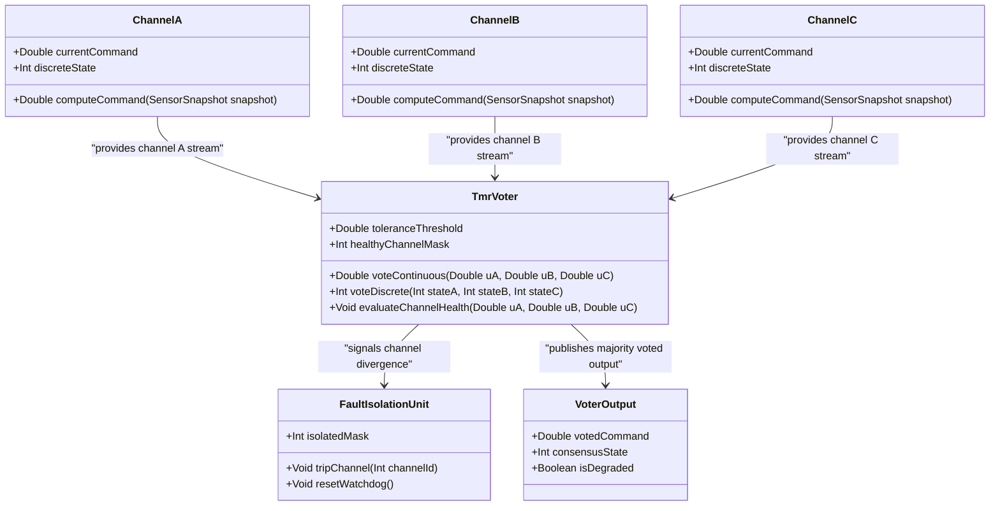

### 3.5 Mermaid State Diagram

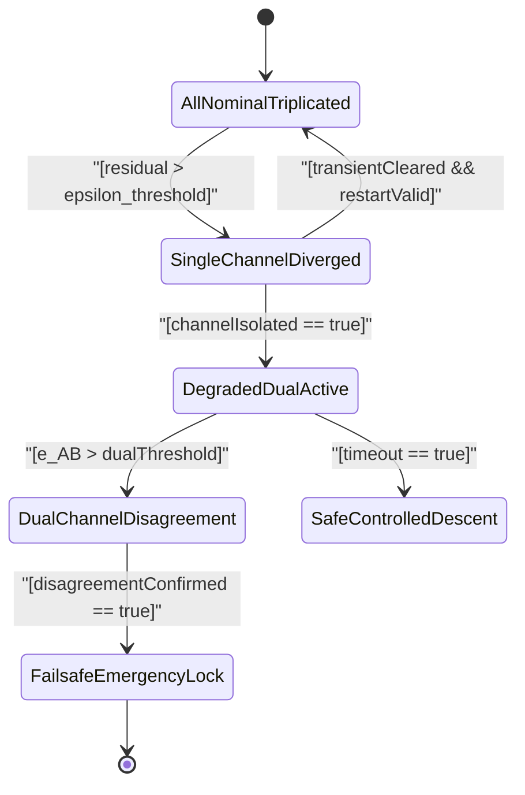

---

## 4. Pattern CP-02: ASTM F3269-17 Run-Time Assurance (RTA) Dual-Channel Simplex Architecture

### 4.1 Context & Regulatory Basis
- **Pattern ID:** `CP-02`
- **Applicable Standards:** ASTM F3269-17 §5.1–§5.3 (*Methods to Safely Bound Flight Behavior of UAS Containing Complex Functions*), RTCA DO-178C §6.3.1 (*Software Architecture & Partitioning*), SAE ARP4761 §5.0 (*Architectural Safety Mitigation*).
- **Design Assurance Allocation:** Primary Complex Controller (DAL C/E or uncertified/AI), Safety Monitor & Recovery Controller (DAL A / DAL B).

/// ObligationAllocation: [OBL-DO178C-02, OBL-ARP4761-03]
/// ObligationWitness: [OBL-DO178C-02, OBL-ARP4761-03]

### 4.2 Architectural Description
Pattern `CP-02` realises the canonical ASTM F3269-17 Run-Time Assurance (RTA) Dual-Channel Simplex Architecture. A high-performance, non-deterministic or adaptive Primary Controller (e.g., neural network trajectory generator, optimization-based path planner) is monitored continuously by a deterministic, verified Safety Monitor.

The Safety Monitor evaluates forward reachability sets and Control Barrier Functions (CBF). If the Primary Controller issues a trajectory command that would violate the vehicle's safe operating envelope $\mathcal{C}$ within the reaction horizon $\tau_{\text{horizon}}$, the high-integrity Assurance Switch overrides the primary command and latches control to the deterministic Recovery Controller (DAL A/B).

### 4.3 Mathematical Transfer Function & Control Barrier Formulation

Let the safe operating flight state set be defined by the 0-superlevel set of a continuously differentiable barrier function $h(x): \mathbb{R}^n \to \mathbb{R}$:

$$
\mathcal{C} = \left\{ x \in \mathbb{R}^n : h(x) \ge 0 \right\}
$$

Under the Control Barrier Function (CBF) theorem with class $\mathcal{K}_\infty$ gain function $\alpha(h)$:

$$
\dot{h}(x, u) = \nabla h(x)^T f(x) + \nabla h(x)^T g(x) u \ge -\alpha(h(x))
$$

The real-time switching selection variable $\sigma(x, u_{\text{primary}}) \in \{0, 1\}$ is defined by:

$$
\sigma(x, u_{\text{primary}}) = \begin{cases}
0 & \text{if } h(x) \ge \epsilon_{\text{margin}} \land \nabla h(x)^T \left(f(x) + g(x) u_{\text{primary}}\right) + \alpha(h(x)) \ge 0 \\
1 & \text{otherwise}
\end{cases}
$$

The synthesized actuator demand $u_{\text{actuator}}(t)$ delivered to flight surfaces is:

$$
u_{\text{actuator}}(t) = (1 - \sigma(t)) \cdot u_{\text{primary}}(t) + \sigma(t) \cdot u_{\text{recovery}}(t)
$$

### 4.4 Mermaid Class Diagram

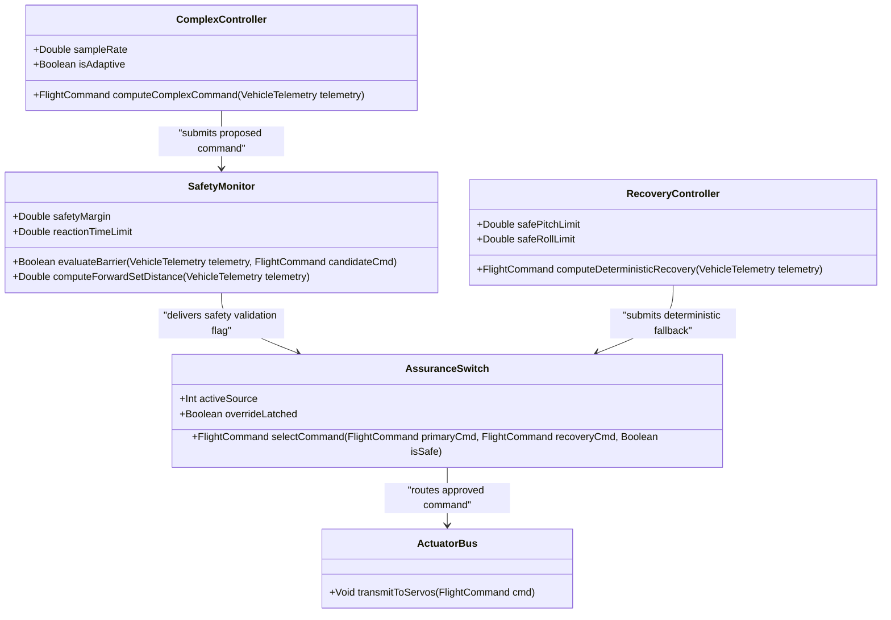

### 4.5 Mermaid State Diagram

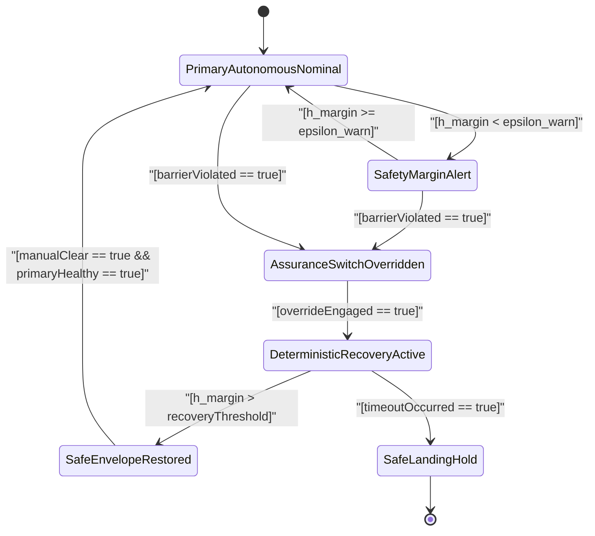

---

## 5. Pattern CP-03: Cross-Channel Data Link (CCDL) Synchronization & Deterministic State Lock

### 5.1 Context & Regulatory Basis
- **Pattern ID:** `CP-03`
- **Applicable Standards:** RTCA DO-178C §6.3.2 (*Data Coupling & Control Coupling Determinism*), RTCA DO-254 §5.5.1 (*Hardware Inter-Channel Clock Domain Synchronization*), SAE ARP4754A §5.6 (*System Architecture Safety Constraints*).
- **Design Assurance Allocation:** DAL A, Hazard Severity: Catastrophic ($10^{-9}/\text{flight hour}$).

/// ObligationAllocation: [OBL-DO178C-02, OBL-DO254-02]
/// ObligationWitness: [OBL-DO178C-02, OBL-DO254-02]

### 5.2 Architectural Description
Pattern `CP-03` provides a deterministic Cross-Channel Data Link (CCDL) protocol for redundant multi-channel flight computers (e.g., dual-dual or triplex flight control computers). It ensures deterministic frame synchronization, lockstep execution, jitter bounding, and atomic state locking.

Cross-channel communication operates over isolated, point-to-point time-triggered physical buses (e.g., optical Fibre Channel, RS-485, or dedicated SPI). Every frame carries a 32-bit monotonic sequence counter, microsecond hardware timestamp, and CRC-32 checksum. The lockstep execution window guarantees that all channels compute identical control laws on identical sampled data at the discrete step boundary ($dt = 0.004\text{ s}$).

### 5.3 Mathematical Transfer Function & Fault-Tolerant Clock Synchronization

The discrete cycle execution period $T_{\text{cycle}}$ must strictly satisfy the deterministic timing budget:

$$
T_{\text{compute}} + T_{\text{ccdl\_exchange}} + T_{\text{voting}} + T_{\text{jitter\_margin}} \le T_{\text{frame\_period}} = 4.0 \cdot 10^{-3}
$$

Under the Welch-Lynch fault-tolerant clock synchronization algorithm for $n=3$ channels with up to $m=1$ Byzantine faulty clock, the local clock correction $\Delta \tau_i$ applied at synchronization boundary $k$ is:

$$
\Delta \tau_i(k) = \frac{1}{2} \left( \min_{j \neq \text{extreme}} \left( \tau_j(k) - \tau_i(k) \right) + \max_{j \neq \text{extreme}} \left( \tau_j(k) - \tau_i(k) \right) \right)
$$

The frame freshness and skew constraint enforces that any frame with transmission delay exceeding the physical threshold $\Delta t_{\text{skew\_max}}$ is discarded:

$$
\Delta t_{\text{frame}} = t_{\text{rx}} - t_{\text{tx}} \le \Delta t_{\text{skew\_max}} = 50 \cdot 10^{-6}
$$

### 5.4 Mermaid Class Diagram

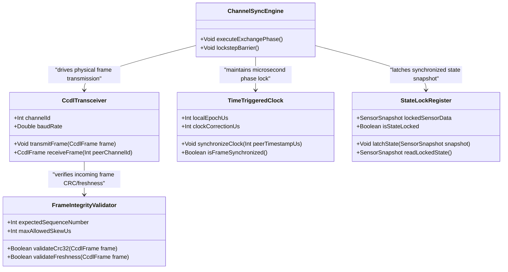

### 5.5 Mermaid State Diagram

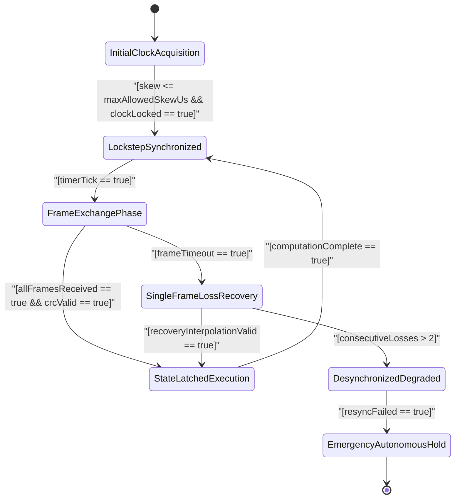

---

## 6. Pattern CP-04: Asymmetric Propulsion / Actuator Degradation Reconfiguration Law

### 6.1 Context & Regulatory Basis
- **Pattern ID:** `CP-04`
- **Applicable Standards:** SAE ARP4761 §4.4 (*Functional Hazard Assessment - Asymmetric Thrust & Surface Jam*), MIL-STD-882E Task 205 §4.2 (*System Hazard Analysis - Propulsion Failure Modes*), SAE ARP4754A §5.4.1 (*System Safety Allocation*).
- **Design Assurance Allocation:** DAL A / DAL B, Hazard Severity: Catastrophic ($10^{-9}/\text{flight hour}$).

/// ObligationAllocation: [OBL-ARP4761-02, OBL-MIL882E-03]
/// ObligationWitness: [OBL-ARP4761-02, OBL-MIL882E-03]

### 6.2 Architectural Description
Pattern `CP-04` provides real-time control reconfiguration for multi-rotor, eVTOL, distributed electric propulsion (DEP), and multi-surface fixed-wing aircraft suffering severe actuator degradation, rotor loss, or control surface jams.

The health monitor detects individual actuator degradation (e.g., motor loss $T_i \to 0$, locked aileron, electrical inverter cutoff). It instantly updates the actuator health effectiveness matrix $\mathbf{W}_{\text{health}}$ and executes dynamic control re-allocation via weighted pseudo-inverse or quadratic programming (QP). When three-axis torque cannot be simultaneously maintained, the reconfiguration law automatically relaxes yaw authority ($\epsilon_{\text{yaw}} \ll w_{\text{roll}}, w_{\text{pitch}}$) to guarantee pitch/roll attitude stabilization and continuous vertical lift.

### 6.3 Mathematical Transfer Function & Reconfiguration Optimization

The general control effectiveness mapping from physical actuator commands $\mathbf{u} \in \mathbb{R}^m$ to total vehicle generalized forces/moments $\mathbf{v} \in \mathbb{R}^4$ is:

$$
\mathbf{v} = \begin{bmatrix} F_z \\ L_d \\ M_d \\ N_d \end{bmatrix} = \mathbf{B} \cdot \mathbf{u}
$$

Let the diagonal actuator health matrix be $\mathbf{W}_{\text{health}} = \operatorname{diag}(\eta_1, \eta_2, \dots, \eta_m)$ where $\eta_i \in [0, 1]$ represents the health index of the $i$-th actuator. The degraded control effectiveness matrix is $\mathbf{B}_{\text{eff}} = \mathbf{B} \cdot \mathbf{W}_{\text{health}}$.

The reconfigured control allocation vector $\mathbf{u}_{\text{alloc}}$ minimizing energy and tracking error under Tikhonov regularization parameter $\lambda$ is:

$$
\mathbf{u}_{\text{alloc}} = \mathbf{W}_{\text{health}} \mathbf{B}^T \left( \mathbf{B} \mathbf{W}_{\text{health}} \mathbf{B}^T + \lambda \mathbf{I} \right)^{-1} \mathbf{v}_{\text{desired}}
$$

Under severe loss where total control authority is compromised, the weighted performance index prioritizes attitude safety over yaw hold:

$$
\min_{\mathbf{u}} \left( \|\mathbf{B}_{\text{eff}} \mathbf{u} - \mathbf{v}_{\text{desired}}\|_{\mathbf{Q}}^2 + \|\mathbf{u}\|_{\mathbf{R}}^2 \right), \quad \mathbf{Q} = \operatorname{diag}\left(w_{\text{thrust}}, w_{\text{roll}}, w_{\text{pitch}}, \epsilon_{\text{yaw}}\right)
$$

### 6.4 Mermaid Class Diagram

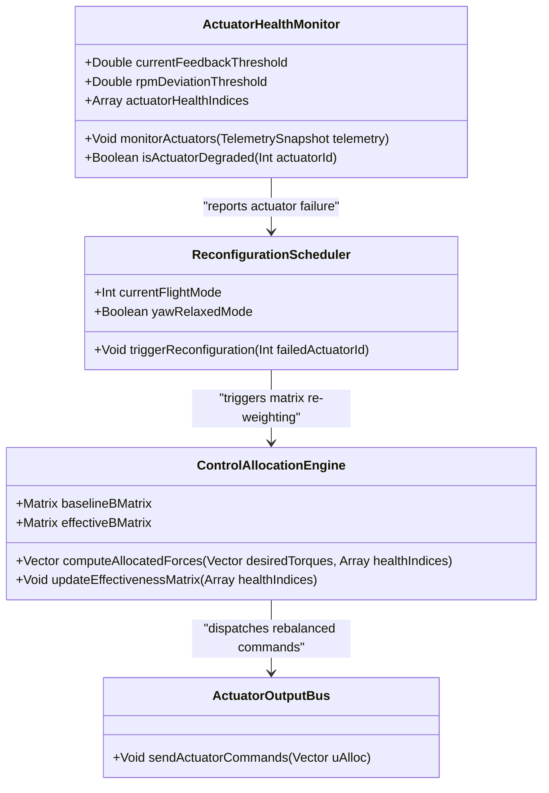

### 6.5 Mermaid State Diagram

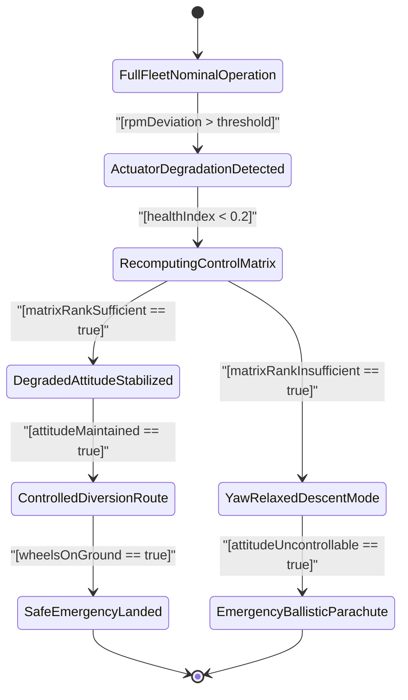

---

## 7. Pattern CP-05: Boundary Geofence Active Containment & Failsafe Return-to-Home / Divert

### 7.1 Context & Regulatory Basis
- **Pattern ID:** `CP-05`
- **Applicable Standards:** JARUS SORA v2.5 Annex B §B.2 (*Containment & Ground Risk Mitigations - High Integrity Geofencing*), ASTM F3411-22a §6.3 (*Spatial Containment & Remote ID*), FAA AC 20-152A §4.2 (*Containment Hardware Assurance*).
- **Design Assurance Allocation:** DAL A / DAL B, High Robustness Containment ($10^{-9}/\text{flight hour}$).

/// ObligationAllocation: [OBL-ARP4754A-03, OBL-MIL882E-04]
/// ObligationWitness: [OBL-ARP4754A-03, OBL-MIL882E-04]

### 7.2 Architectural Description
Pattern `CP-05` provides continuous 3D spatial boundary geofence monitoring, predictive boundary breach projection, active kinematic braking, and deterministic autonomous Return-to-Home (RTH) / Diversion failsafes for unmanned and autonomous aircraft.

The geofence volume is modeled as a 3D convex or non-convex bounding polytope with horizontal polygon facets and minimum/maximum altitude ceilings. The predictive trajectory engine calculates the dynamic Time-to-Boundary ($\text{TTB}$) based on current 3D velocity vector $\mathbf{v}(t)$, vehicle deceleration limit $a_{\text{max\_decel}}$, and system latency $\tau_{\text{latency}}$.

If $\text{TTB}$ drops below the critical braking threshold $\text{TTB}_{\text{brake}}$, the pattern overrides flight plan navigation, executes immediate maximum-rate containment turn-back or kinematic braking, and commands autonomous transit along a cleared return corridor to a safe landing zone.

### 7.3 Mathematical Transfer Function & Predictive Boundary Formulation

Let the approved flight operational volume be represented by the closed 3D polytope $\mathcal{G} \subset \mathbb{R}^3$. For current vehicle position $\mathbf{p}(t) = [x(t), y(t), z(t)]^T$ and velocity vector $\mathbf{v}(t)$:

The minimum signed distance to the boundary facets $\partial \mathcal{G}$ with outward unit normal vectors $\hat{\mathbf{n}}_k$ is:

$$
d_{\text{boundary}}(\mathbf{p}) = \min_{k \in \text{facets}} \left( (\mathbf{q}_k - \mathbf{p}) \cdot \hat{\mathbf{n}}_k \right)
$$

The dynamic forward braking distance $d_{\text{brake}}(\mathbf{v})$ required to bring the vehicle to a full halt before crossing the boundary is:

$$
d_{\text{brake}}(\mathbf{v}) = \frac{\|\mathbf{v}(t)\|^2}{2 \cdot a_{\text{max\_decel}}} + \|\mathbf{v}(t)\| \cdot \tau_{\text{latency}} + d_{\text{safety\_margin}}
$$

The predictive Time-to-Boundary ($\text{TTB}$) projection is:

$$
\text{TTB}(t) = \frac{d_{\text{boundary}}(\mathbf{p}(t))}{\max\left( 0.001, \mathbf{v}(t) \cdot \hat{\mathbf{n}}_{\text{nearest}} \right)}
$$

The active containment decision logic executes according to:

$$
\text{Mode}(t) = \begin{cases}
\text{NOMINAL} & \text{if } d_{\text{boundary}}(\mathbf{p}) > d_{\text{brake}}(\mathbf{v}) \land \text{TTB} > \tau_{\text{warn}} \\
\text{CONTAINMENT\_ALERT} & \text{if } d_{\text{brake}}(\mathbf{v}) < d_{\text{boundary}}(\mathbf{p}) \le d_{\text{brake}}(\mathbf{v}) + d_{\text{buffer}} \\
\text{ACTIVE\_BRAKE\_RTH} & \text{if } d_{\text{boundary}}(\mathbf{p}) \le d_{\text{brake}}(\mathbf{v}) \lor \text{TTB} \le \tau_{\text{crit}}
\end{cases}
$$

### 7.4 Mermaid Class Diagram

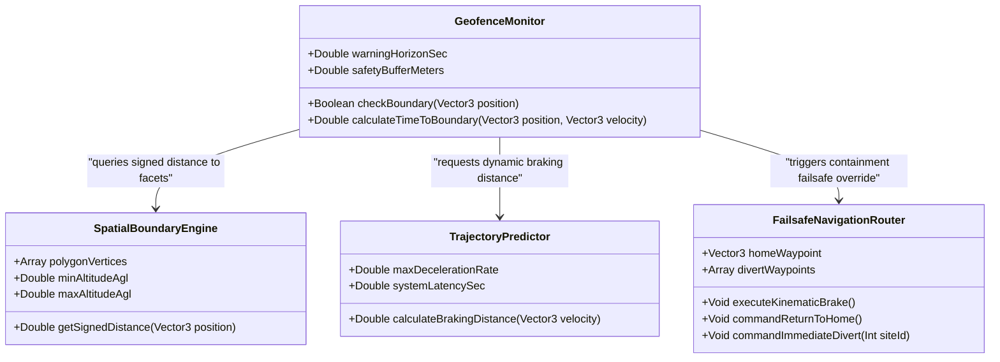

### 7.5 Mermaid State Diagram

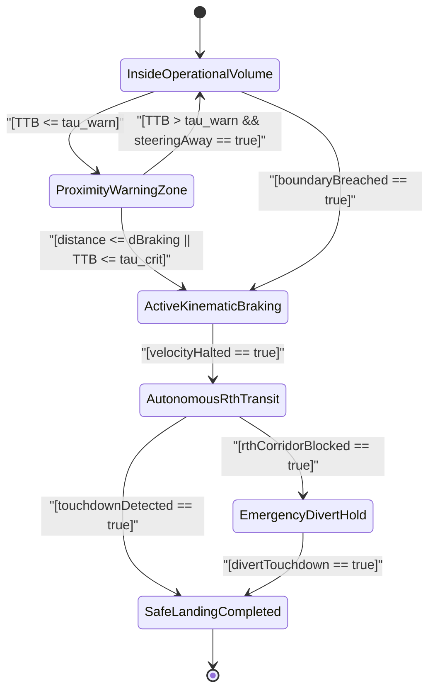

---

## 8. Pattern CP-06: Flight Termination System (FTS) Dual-Consent Command Interlock

### 8.1 Context & Regulatory Basis
- **Pattern ID:** `CP-06`
- **Applicable Standards:** FAA 14 CFR §107.39 (*Operations Over Human Beings - Flight Termination & Safe Parachute Deployment*), MIL-STD-882E Task 204 §4.1 (*Subsystem Hazard Analysis - Safety-Critical Interlocks*), RTCA DO-254 §5.5.1 (*Electronic Hardware Interlock Design*).
- **Design Assurance Allocation:** DAL A, Spurious Firing Probability $\le 10^{-9}/\text{flight hour}$, Commanded Reliability $\ge 0.99999$.

/// ObligationAllocation: [OBL-MIL882E-02, OBL-DO254-03]
/// ObligationWitness: [OBL-MIL882E-02, OBL-DO254-03]

### 8.2 Architectural Description
Pattern `CP-06` establishes a hardware-enforced and software-authenticated Dual-Consent Command Interlock for non-recoverable Flight Termination Systems (FTS), ballistic parachute deployment squibs, and high-voltage emergency battery isolation contactors.

To eliminate single-point inadvertent deployment while guaranteeing 100% termination execution under catastrophic loss of control, the system requires two independent, asynchronous consent signals:
1. **ARM Consent Channel:** Validates the arming command, energizes the primary high-side power gate, and starts a strict countdown hardware arming window ($\tau_{\text{arm}} = 10.0\text{ s}$).
2. **FIRE Consent Channel:** Validates the cryptographically signed fire pulse, enables the low-side solid-state switch, and delivers the firing current to the pyrotechnic squib/terminator.

If the FIRE command is not received before the hardware window $\tau_{\text{arm}}$ expires, the system automatically discharges and returns to the safe disarmed state.

### 8.3 Mathematical Transfer Function & Interlock Formulation

The discrete Boolean activation condition for the flight termination trigger $\text{Trigger}_{\text{FTS}}(t) \in \{0, 1\}$ is:

$$
\text{Trigger}_{\text{FTS}}(t) = \text{Consent}_{\text{ARM}}(t) \land \text{Consent}_{\text{FIRE}}(t) \land \mathbb{I}\left( 0 < t - t_{\text{ARM\_pulse}} \le \tau_{\text{window}} \right) \land \neg \text{Interlock}_{\text{Lockout}}(t)
$$

The overall probability of spurious flight termination $P(\text{Spurious Trigger})$ across independent, dissimilar physical channels is provably bounded by:

$$
P(\text{Spurious Trigger}) = P(\text{Spurious}_{\text{ARM}}) \cdot P(\text{Spurious}_{\text{FIRE}}) \le 10^{-5} \cdot 10^{-5} = 10^{-10} \le 10^{-9}
$$

The pyrotechnic capacitor discharge current waveform $i_{\text{squib}}(t)$ delivered across squib resistance $R_{\text{squib}}$ and capacitance $C_{\text{fire}}$ satisfies:

$$
i_{\text{squib}}(t) = \frac{V_{\text{cap}}}{R_{\text{squib}}} e^{-t / (R_{\text{squib}} C_{\text{fire}})} \cdot \mathbb{I}\left( 0 \le t \le \tau_{\text{discharge}} \right), \quad i_{\text{squib}}(0) = I_{\text{peak}} \ge I_{\text{all\_fire\_threshold}}
$$

### 8.4 Mermaid Class Diagram

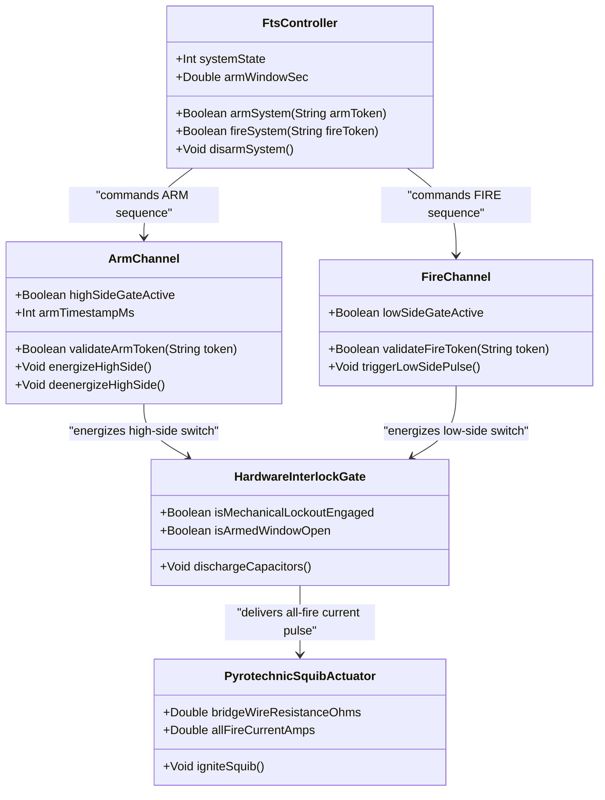

### 8.5 Mermaid State Diagram

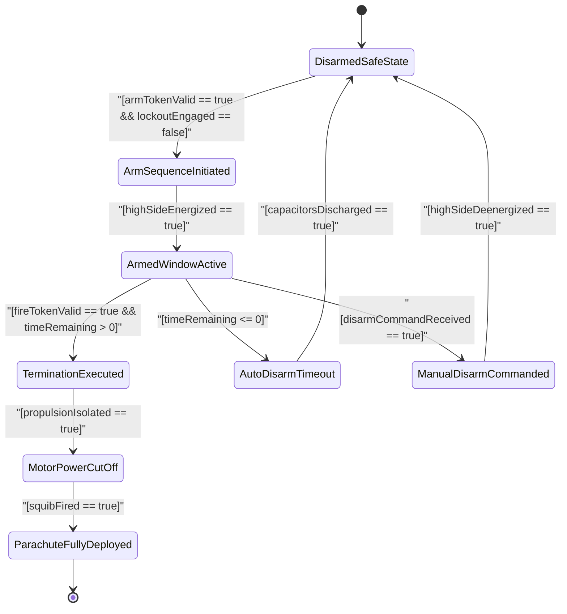

---

## 9. Master Traceability & Verification Mapping

| Pattern ID | Pattern Name | Allocated Standards & Clauses | Realized Obligation Tags | Target Subsystem Allocation | Primary Verification Artifact |
| :--- | :--- | :--- | :--- | :--- | :--- |
| `CP-01` | Triple Modular Redundant (TMR) Majority Voting | FAA AC 20-152A §4.2, SAE ARP4754A §5.4.2, RTCA DO-254 §5.5.1 | `OBL-DO254-02`, `OBL-ARP4754A-03` | Primary Flight Computer Voter | `tests/test_tmr_voting.py` |
| `CP-02` | ASTM F3269-17 Run-Time Assurance (RTA) Dual-Channel Simplex | ASTM F3269-17 §5.1–§5.3, RTCA DO-178C §6.3.1, SAE ARP4761 §5.0 | `OBL-DO178C-02`, `OBL-ARP4761-03` | Safety Assurance Monitor | `tests/test_rta_simplex.py` |
| `CP-03` | Cross-Channel Data Link (CCDL) Synchronization | RTCA DO-178C §6.3.2, RTCA DO-254 §5.5.1, SAE ARP4754A §5.6 | `OBL-DO178C-02`, `OBL-DO254-02` | Inter-Channel CCDL Bus | `tests/test_ccdl_sync.py` |
| `CP-04` | Asymmetric Propulsion / Actuator Degradation Reconfiguration Law | SAE ARP4761 §4.4, MIL-STD-882E Task 205 §4.2, SAE ARP4754A §5.4.1 | `OBL-ARP4761-02`, `OBL-MIL882E-03` | Control Allocation Matrix | `tests/test_actuator_reconfig.py` |
| `CP-05` | Boundary Geofence Active Containment & Failsafe Return-to-Home | JARUS SORA v2.5 Annex B §B.2, ASTM F3411-22a §6.3, FAA AC 20-152A §4.2 | `OBL-ARP4754A-03`, `OBL-MIL882E-04` | Autonomous Geofence Router | `tests/test_geofence_containment.py` |
| `CP-06` | Flight Termination System (FTS) Dual-Consent Command Interlock | FAA 14 CFR §107.39, MIL-STD-882E Task 204 §4.1, RTCA DO-254 §5.5.1 | `OBL-MIL882E-02`, `OBL-DO254-03` | FTS Hardware Interlock Unit | `tests/test_fts_dual_consent.py` |
