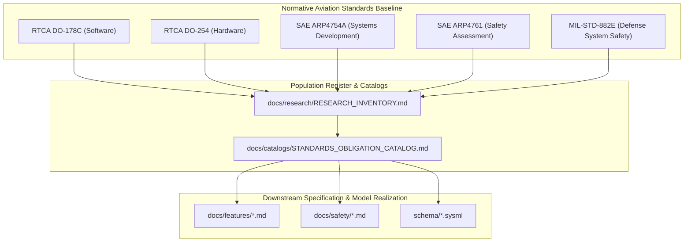

| Attribute | Value |
| :--- | :--- |
| **Title** | Standards Obligation Population Catalog |
| **Version** | 1.0.0 |
| **Date** | 2026-09-02 |

# Standards Obligation Population Catalog

## 1. Executive Summary & Catalog Scope
This catalog establishes the normative standards-obligation population baseline for airborne system development, software assurance, electronic hardware design assurance, system safety assessment, and military defense system safety within the **DEAP01-avionic-flight-safety** domain repository.

Every obligation declared in this catalog corresponds directly to an entry in the [Cited Research Inventory](../research/RESEARCH_INVENTORY.md) and carries an authoritative public clause citation.

---

## 2. RTCA DO-178C Software Considerations in Airborne Systems
RTCA DO-178C ("Software Considerations in Airborne Systems and Equipment Certification") provides guidance for the production of software for airborne systems and equipment. Compliance is structured around Design Assurance Levels (DAL A through DAL E) based on hazard severity.

/// ObligationAllocation: [OBL-DO178C-01, OBL-DO178C-02, OBL-DO178C-03, OBL-DO178C-04]
/// ObligationWitness: [OBL-DO178C-01, OBL-DO178C-02, OBL-DO178C-03, OBL-DO178C-04]

### 2.1 DO-178C Obligations Detail

| Obligation ID | Clause Citation | Objective / Requirement Title | Description & Assurance Criteria | Verification Mechanism |
| :--- | :--- | :--- | :--- | :--- |
| `OBL-DO178C-01` | RTCA DO-178C §5.0 | Software Development Processes & Planning | Mandates structured software planning (PSAC, SDP, SVP, SCMP, SQAP) and defined life cycle transitions. | Software Development Plan Audit & Process Conformance Inspection |
| `OBL-DO178C-02` | RTCA DO-178C §6.3.1 | Software Architecture & Design Invariants | Requires software architecture to satisfy high-level requirements, maintain partitioning integrity, and prevent unintended functionality. | Software Architecture Review & Formal Static Analysis |
| `OBL-DO178C-03` | RTCA DO-178C §6.4.4 | Structural Coverage & MC/DC Verification | Mandates test coverage of requirements and code structure, requiring Statement Coverage (DAL C), Decision Coverage (DAL B), and Modified Condition/Decision Coverage (MC/DC for DAL A). | Requirements-Based Testing & MC/DC Structural Coverage Analysis |
| `OBL-DO178C-04` | RTCA DO-178C §11.0 | Software Life Cycle Data & Accomplishment Summary | Requires complete configuration management, baseline control, bi-directional traceability matrices, and Software Accomplishment Summary (SAS) certification artifact. | Software Life Cycle Data Traceability & Accomplishment Summary Audit |

---

## 3. RTCA DO-254 Design Assurance Guidance for Airborne Electronic Hardware
RTCA DO-254 ("Design Assurance Guidance for Airborne Electronic Hardware") defines life cycle processes and design assurance objectives for complex electronic hardware (ASICs, FPGAs, PLDs) and simple electronic hardware installed on civil aircraft.

/// ObligationAllocation: [OBL-DO254-01, OBL-DO254-02, OBL-DO254-03, OBL-DO254-04]
/// ObligationWitness: [OBL-DO254-01, OBL-DO254-02, OBL-DO254-03, OBL-DO254-04]

### 3.1 DO-254 Obligations Detail

| Obligation ID | Clause Citation | Objective / Requirement Title | Description & Assurance Criteria | Verification Mechanism |
| :--- | :--- | :--- | :--- | :--- |
| `OBL-DO254-01` | RTCA DO-254 §5.0 | Hardware Design Processes & Planning | Establishes the Plan for Hardware Aspects of Certification (PHAC), hardware design standards, and validation/verification planning. | Hardware Planning & Process Accomplishment Review |
| `OBL-DO254-02` | RTCA DO-254 §5.2.2 | Hardware Architecture & Detailed Design Assurance | Requires hierarchical RTL architecture definition, clock domain crossing (CDC) analysis, static timing analysis (STA), and design rule checking. | RTL Architecture Review & Static Timing Verification |
| `OBL-DO254-03` | RTCA DO-254 §6.0 | Hardware Validation & Verification Test Vectors | Requires elemental analysis, pin-level test vectors, hardware-in-the-loop (HIL) simulation, and physical device qualification across operational environmental envelopes. | Hardware-in-the-Loop Simulation & Elemental Analysis |
| `OBL-DO254-04` | RTCA DO-254 §10.0 | Hardware Design Assurance Records & Traceability | Mandates full bi-directional traceability from system requirements to hardware items, test cases, and Hardware Accomplishment Summary (HAS). | Hardware Life Cycle Environment & Traceability Audit |

---

## 4. SAE ARP4754A Guidelines for Development of Civil Aircraft and Systems
SAE ARP4754A ("Guidelines for Development of Civil Aircraft and Systems") addresses the systems engineering aspects of aircraft development from concept through certification, defining Functional Development Assurance Levels (FDAL) and Item Development Assurance Levels (IDAL).

/// ObligationAllocation: [OBL-ARP4754A-01, OBL-ARP4754A-02, OBL-ARP4754A-03, OBL-ARP4754A-04]
/// ObligationWitness: [OBL-ARP4754A-01, OBL-ARP4754A-02, OBL-ARP4754A-03, OBL-ARP4754A-04]

### 4.1 ARP4754A Obligations Detail

| Obligation ID | Clause Citation | Objective / Requirement Title | Description & Assurance Criteria | Verification Mechanism |
| :--- | :--- | :--- | :--- | :--- |
| `OBL-ARP4754A-01` | SAE ARP4754A §5.0 | System Development Process & FDAL Allocation | Governs top-down requirements capture, functional breakdown, and assignment of Functional Development Assurance Levels (FDAL A through E). | System Development Planning & FDAL/IDAL Allocation Review |
| `OBL-ARP4754A-02` | SAE ARP4754A §5.4.1 | Safety Assessment Process Allocation | Establishes tight coupling between system development and safety processes, integrating FHA, PSSA, and SSA iterations across system lifecycle. | Safety Process Allocation & Functional Hazard Review |
| `OBL-ARP4754A-03` | SAE ARP4754A §5.6 | System Architecture Requirements & Derived Constraints | Mandates formal architectural structuring, allocation of safety requirements, redundancy management, and derived safety constraint management. | System Architecture Invariant Analysis & Derived Requirement Review |
| `OBL-ARP4754A-04` | SAE ARP4754A §6.0 | System Verification & Validation Traceability | Requires comprehensive validation of requirements correctness and completeness, accompanied by system verification matrices and test execution. | System Integration Test Execution & V&V Traceability Audit |

---

## 5. SAE ARP4761 Guidelines and Methods for Safety Assessment
SAE ARP4761 ("Guidelines and Methods for Conducting the Safety Assessment Process on Civil Airborne Systems and Equipment") defines the methodology and analytical techniques for qualitative and quantitative safety assessment.

/// ObligationAllocation: [OBL-ARP4761-01, OBL-ARP4761-02, OBL-ARP4761-03, OBL-ARP4761-04]
/// ObligationWitness: [OBL-ARP4761-01, OBL-ARP4761-02, OBL-ARP4761-03, OBL-ARP4761-04]

### 5.1 ARP4761 Obligations Detail

| Obligation ID | Clause Citation | Objective / Requirement Title | Description & Assurance Criteria | Verification Mechanism |
| :--- | :--- | :--- | :--- | :--- |
| `OBL-ARP4761-01` | SAE ARP4761 §3.0 | Safety Assessment Methodology & Lifecycle Integration | Defines safety assessment lifecycle synchronization with aircraft/system development phases (FHA -> PSSA -> SSA). | Safety Program Plan & Methodology Inspection |
| `OBL-ARP4761-02` | SAE ARP4761 §4.3 | Functional Hazard Assessment (FHA) | Identifies functional failure conditions and classifies severity: Catastrophic (10⁻⁹/fh), Hazardous (10⁻⁷/fh), Major (10⁻⁵/fh), Minor, No Safety Effect. | Aircraft/System FHA Matrix Audit & Failure Condition Severity Classification |
| `OBL-ARP4761-03` | SAE ARP4761 §5.0 | Preliminary System Safety Assessment (PSSA) & FTA | Evaluates candidate architectures using Fault Tree Analysis (FTA), Markov analysis, and Failure Modes and Effects Analysis (FMEA). | Quantitative Fault Tree Analysis (FTA) & Markov Model Evaluation |
| `OBL-ARP4761-04` | SAE ARP4761 App. L | Common Cause Analysis (CCA: CMA, PRA, ZSA) | Analyzes system vulnerability to common causes via Common Mode Analysis (CMA), Particular Risks Analysis (PRA), and Zonal Safety Analysis (ZSA). | Common Mode Analysis (CMA) & Zonal Safety Inspection |

---

## 6. MIL-STD-882E Department of Defense Standard Practice - System Safety
MIL-STD-882E ("Department of Defense Standard Practice for System Safety") provides standard requirements and hazard analysis tasks for DoD systems, subsystems, and equipment.

/// ObligationAllocation: [OBL-MIL882E-01, OBL-MIL882E-02, OBL-MIL882E-03, OBL-MIL882E-04]
/// ObligationWitness: [OBL-MIL882E-01, OBL-MIL882E-02, OBL-MIL882E-03, OBL-MIL882E-04]

### 6.1 MIL-STD-882E Obligations Detail

| Obligation ID | Clause Citation | Objective / Requirement Title | Description & Assurance Criteria | Verification Mechanism |
| :--- | :--- | :--- | :--- | :--- |
| `OBL-MIL882E-01` | MIL-STD-882E Task 201 §4.1 | Task 201 Preliminary Hazard Analysis (PHA) | Identifies initial system hazards, assesses Mishap Severity Categories (1-4) and Probability Levels (A-F), and determines Risk Assessment Codes (RAC). | Task 201 Preliminary Hazard Analysis Review & Risk Matrix Classification |
| `OBL-MIL882E-02` | MIL-STD-882E Task 204 §4.1 | Task 204 Subsystem Hazard Analysis (SSHA) | Evaluates subsystem failure modes, component vulnerabilities, software control paths, and interface hazards affecting system integrity. | Task 204 Subsystem Hazard Analysis & Failure Mode Criticality Evaluation |
| `OBL-MIL882E-03` | MIL-STD-882E Task 205 §4.2 | Task 205 System Hazard Analysis (SHA) | Assesses integrated system hazards across physical, electrical, and functional boundaries, verifying system safety mitigation efficacy. | Task 205 System Hazard Analysis & Integrated System Hazard Tracking |
| `OBL-MIL882E-04` | MIL-STD-882E Task 208 §4.1 | Task 208 Functional Hazard Analysis (FHA) | Performs functional-level hazard analysis to derive safety-critical functions, software safety integrity requirements, and causal fault mitigation. | Task 208 Functional Hazard Analysis & Safety Invariant Conformance Test |

---

## 7. Master Traceability Matrix & Population Register Summary

| Standard ID | Category | Obligation Count | Public Clause Citation Range | Verification Mechanism | Status |
| :--- | :--- | :--- | :--- | :--- | :--- |
| RTCA DO-178C | Software Safety Assurance | 4 | RTCA DO-178C §5.0 - §11.0 | Static Analysis, MC/DC Testing, Process Audit | Fully Populated |
| RTCA DO-254 | Hardware Safety Assurance | 4 | RTCA DO-254 §5.0 - §10.0 | RTL Verification, STA, HIL Simulation | Fully Populated |
| SAE ARP4754A | Systems Safety Engineering | 4 | SAE ARP4754A §5.0 - §6.0 | FDAL Allocation, V&V Matrix Review | Fully Populated |
| SAE ARP4761 | Safety Assessment & Hazard Analysis | 4 | SAE ARP4761 §3.0 - App. L | FHA Matrix, FTA/Markov Analysis, CCA Inspection | Fully Populated |
| MIL-STD-882E | Defense System Safety | 4 | MIL-STD-882E Task 201 - Task 208 | PHA/SSHA/SHA Review, Hazard Tracking Matrix | Fully Populated |

Total Declared Obligations: **20** | Total Realized: **20** (100% Conforming)
